# praktikum.prt4

## Membuat Table pegawai
```SQL
CREATE TABLE pegawai (
    id_pegawai VARCHAR(10) PRIMARY KEY,
    nama_depan VARCHAR(50),
    nama_belakang VARCHAR(50),
    email VARCHAR(100),
    telepon VARCHAR(15),
    tgl_kontrak DATE,
    id_job VARCHAR(10),
    gaji INT,
    tunjangan INT
);
```

## Memasukkan Data ke Dalam Table
```SQL
INSERT INTO pegawai (id_pegawai, nama_depan, nama_belakang, email, telepon, tgl_kontrak, id_job, gaji, tunjangan) VALUES
('E001', 'Ferry', 'Gustiawan', 'ferry@yahoo.com', '07117059004', '2005-09-01', 'L0001', 2000000, 500000),
('E002', 'Aris', 'Ganiardi', 'aris@yahoo.com', '081312345678', '2006-09-01', 'L0002', 2000000, 200000),
('E003', 'Faiz', 'Ahnad', 'faiz@gmail.com', '081367384322', '2006-10-01', 'L0003', 1500000, NULL),
('E004', 'Emna', 'Bunton', 'enna@gmail.com', '081363484342', '2006-10-01', 'L0004', 1500000, 900000),
('E005', 'Mike', 'Scoff', 'mike@plasa.com', '08163454555', '2007-09-01', 'L0005', 1250000, 900000),
('E006', 'Lincoln', 'Burrows', 'linc@yahoo.com', '08527388432', '2008-09-01', 'L0006', 1750000, NULL);
```
## Menampilkan Data Pada Table
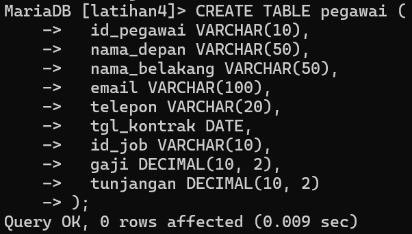

1. Tampilkan pegawai yang gajinya bukan 2.000.000 dan 1.250.000!
   ```SQL
   SELECT * FROM pegawai WHERE gaji NOT IN (2000000, 1250000);
   ```
   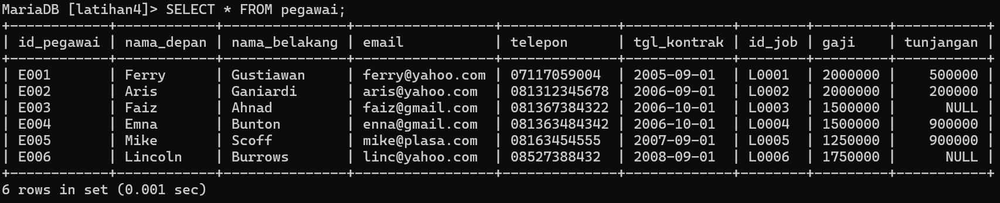

2. Tampilkan pegawai yang tunjangannya NULL!
   ```SQL
   SELECT * FROM pegawai WHERE tunjangan IS NULL;
   ```

   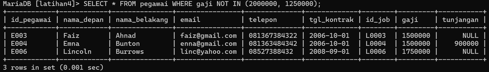

3. Tampilkan pegawai yang tunjangannya tidak NULL!
   ```SQL
   SELECT * FROM pegawai WHERE tunjangan IS NOT NULL;
   ```
   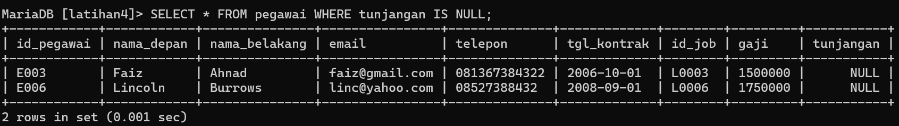

4. Tampilkan/hitung jumlah baris/record tabel pegawai!
   ```sql
   SELECT COUNT(*) AS Jumlah_Baris FROM pegawai;
   ```

   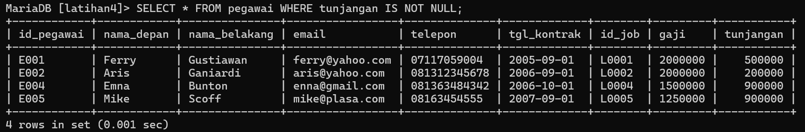

5. Tampilkan/hitung jumlah total gaji di tabel pegawai!
   ```sql
   SELECT SUM(gaji) AS Jumlah_Total_Gaji FROM pegawai;
   ```

   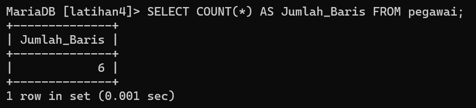

6. Tampilkan/hitung rata-rata gaji pegawai!
   ```sql
   SELECT AVG(gaji) AS Rata_Rata_Gaji FROM pegawai;
   ```
   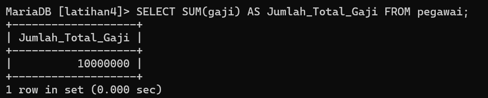

7. Tampilkan gaji terkecil!
   ```sql
   SELECT MIN(gaji) AS Gaji_Terkecil FROM pegawai;
   ```
   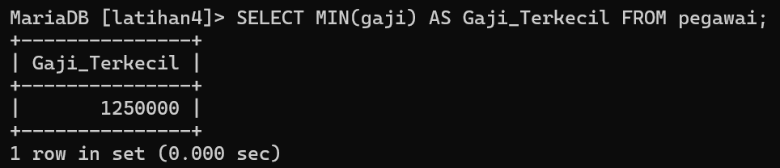

8. Tampilkan gaji terbesar!
   ```sql
   SELECT MAX(gaji) AS Gaji_Terbesar FROM pegawai;
   ```
   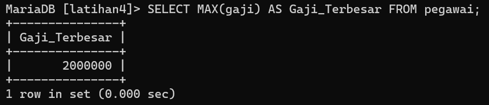

## Membuat Table Hewan
```sql
CREATE TABLE hewan (
    id VARCHAR(10) PRIMARY KEY,
    name VARCHAR(50),
    owner VARCHAR(50),
    species VARCHAR(50),
    sex CHAR(1)
);
```

## Memasukkan Data ke Dalam Table
```sql
INSERT INTO hewan (id, name, owner, species, sex) VALUES
('P1', 'Puffball', 'Diane', 'Hamster', 'f'),
('P2', 'Claws', 'Gwen', 'cat', 'm'),
('P3', 'Fluffy', 'Haro 1d', 'cat', 'f'),
('P4', 'Buffy', 'Haro 1d', 'dog', 'f'),
('P5', 'Fang', 'Benny', 'dog', 'm'),
('P6', 'Bowser', 'Diane', 'dog', 'm'),
('P7', 'Chirpy', 'Gwen', 'bird', 'f'),
('P8', 'Whistler', 'Gwen', 'bird', NULL),
('P9', 'Slim', 'Benny', 'snake', 'm');
```
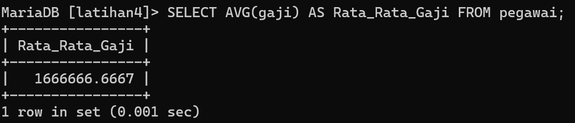

1. Tampilkan jumlah hewan yang dimiliki setiap owner.
   ```sql
   SELECT owner, COUNT(*) AS jumlah_hewan
   FROM hewan
   GROUP BY owner;
   ```
   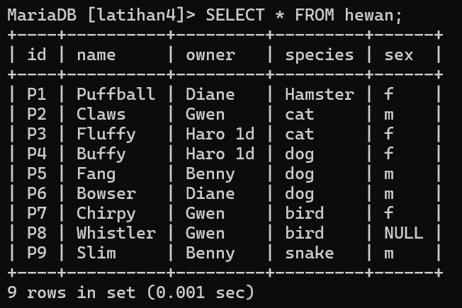

2. Tampilkan jumlah hewan berdasarkan spesies
   ```sql
   SELECT species, COUNT(*) AS jumlah_hewan
   FROM hewan
   GROUP BY species;
   ```
   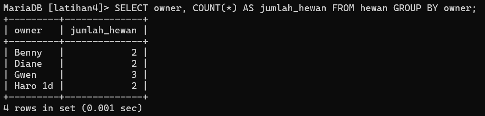

3. Tampilkan jumlah hewan berdasarkan jenis kelamin
   ```sql
   SELECT sex, COUNT(*) AS jumlah_hewan
   FROM hewan
   GROUP BY sex;
   ```
   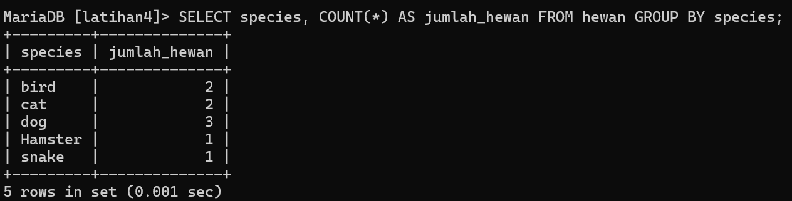

4. Tampilkan jumlah hewan berdasarkan spesies dan jenis kelamin
   ```sql
   SELECT species, sex, COUNT(*) AS jumlah_hewan
   FROM hewan
   GROUP BY species, sex;
   ```
   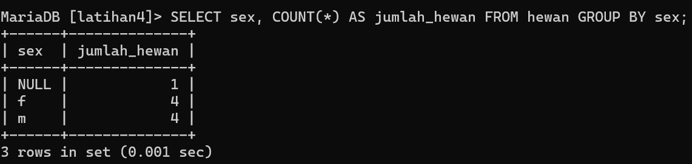

5. Tampilkan jumlah hewan berdasarkan spesis (cat dan dog saja) dan jenis kelamin
   ```sql
   SELECT species, sex, COUNT(*) AS jumlah_hewan
   FROM hewan
   WHERE species IN ('cat', 'dog')
   GROUP BY species, sex;
   ```
   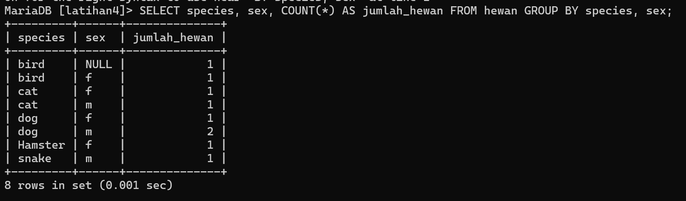

6. Tampilkan jumlah hewan berdasarkan jenis kelamin yang diketahui
saja
    ```sql
    SELECT sex, COUNT(*) AS jumlah_hewan
    FROM hewan
    WHERE sex IS NOT NULL
    GROUP BY sex;
    ```
    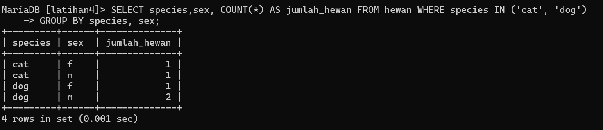

    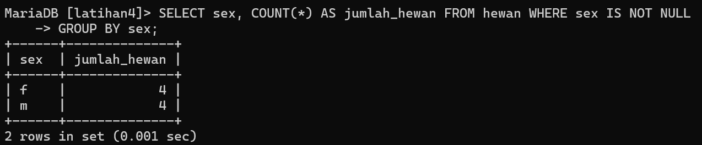

   

   
